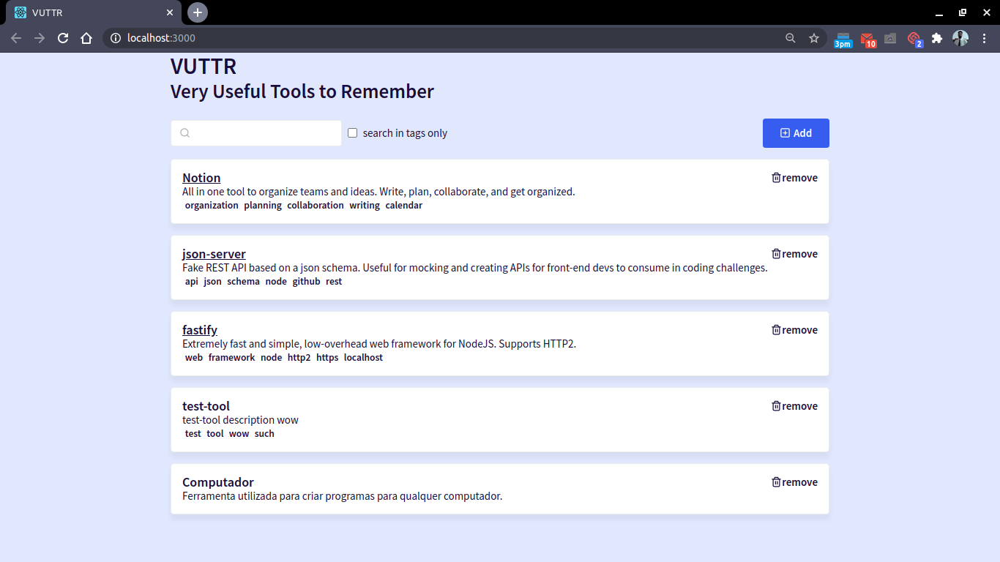
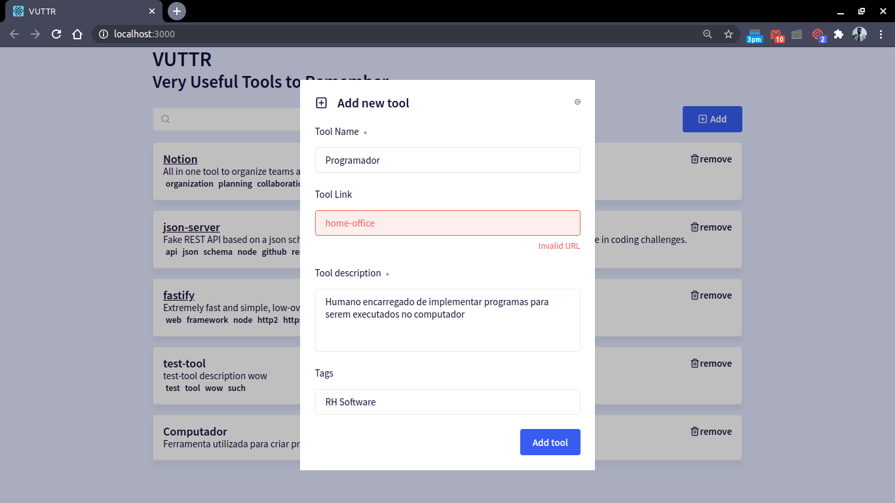
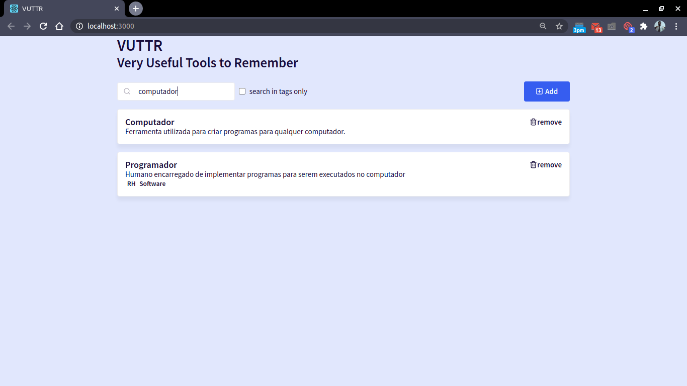
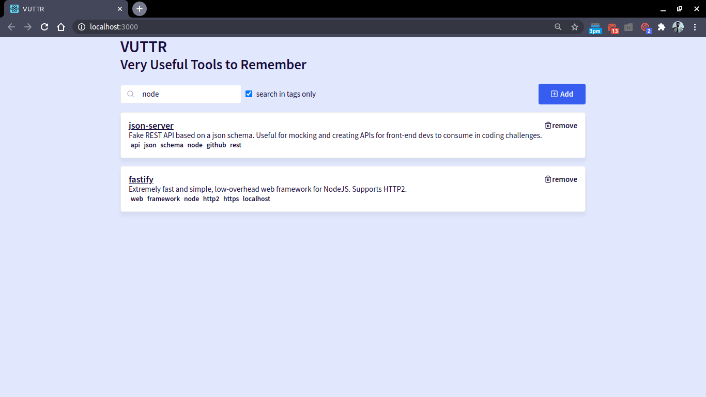

# Very Useful Tools to Remember (web)

O VUTTR é um aplicativo para gerenciamento de lista de ferramentas, cada uma contendo título, descrição, link e uma lista de tags. Este repositório apresenta sua versão web, que foi criado seguindo os parâmetros propostos pela BossaBox como um teste de habilidade de desenvolvimento front-end.

A página inicial apresenta a lista das ferramentas cadastradas, cada uma contendo seu nome, descrição e tags. Caso a ferramenta tenha sido criada com link, este estará acessível pelo nome da ferramenta (que neste caso estará sublinhado). Cada ferramenta possui ainda um botão para ser removida.

Na parte superior da tela, há um botão para adicionar uma nova ferramenta.

No modal aberto por esse botão temos os campos necessários para criação de uma nova ferramenta. Podemos notar aqui, que embora o link não seja obrigatório, caso ele sejá preenchido deverá conter uma url.

Ainda na parte superior da tela, temos um campo para por buscar ferramentas. Ao lado desse campo temos um checkbox para restringir as buscas apenas pelas tags registradas na ferramenta.

## Executando o projeto

Você pode verificar todas as telas e funcionalidades rodando diretamente em seu computador. Para isso baixe/clone o repositório, instale as dependências no projeto rodando `yarn` no diretório do projeto, rode uma versão fake do servidor com `yarn json-server mock-db.json -p 3333` e finalmente rode o projeto com `yarn start`.

Obviamente para isso você deve ter o NodeJS e yarn instalados em seu computador. Caso tudo ocorra como esperado, seu navegador será aberto automaticamente no endereço http://localhost:3000 apresentando o VUTTR. Divirta-se.

## Como o projeto foi criado

O projeto foi criado utilizando [Create React App](https://github.com/facebook/create-react-app) que cria um projeto react já com as principais dependências e configurações instaladas e configuradas. Foi utilizado ainda a flag `--template=typescript` que acrescenta outras dependências e configurações deixando o projeto preparado para ser implementado com typescript.

### Arquitetura

Os arquivos estão organizado de maneira simples:
  - soltos na raiz temos arquivos de configuração.
  - a pasta `docs` reúne arquivos utilizados para explicar o projeto, tais como as imagens que você viu nesse readme.
  - a pasta `public` contem os arquivos estáticos, neste caso apenas um `index.html`.
  - a pasta `node_modules`, que só existirá após instalar as dependências do projeto, contem exatamente isso, os pacotes necessários para rodar esse projeto.
  - finalmente a pasta `src` contem os códigos:
    - `index.tsx` carrega o app e o insere na página.
    - `index.css` carrega definições de estilo globais.
    - `App.tsx` e `App.css` definem uma div que contem todo o conteúdo da aplicação.
    - `pages` define as páginas da aplicação. Neste momento, apenas `Dashboard`, que é a página inicial, sem nenhum modal aberto.
    - `services` define como se conectar ao servidor.
    - `hooks` define o contexto (React.Context) no qual o app deve ser executado, fornecendo valores e funcionalidades, no formato de react hooks, que podem ser utilizadas por qualquer componente da aplicação. Se você está procurando pelas regras de negócio desse front-end, provavelmente é nessa pasta que você vai encontrar.
    - `components` define todos os componentes da aplicação:
      - `Tool` o card que apresenta cada ferramenta no Dashboard.
      - `RemoveButton` o botão de remover que aparece em cada card de Tool.
      - `AddButton` o botão para adicionar ferramenta no canto superior direito do Dashboard.
      - `Input` cada campo de input do form de adição de ferramenta.
      - `SearchBar` a barra de busca que aparece no canto superior esquerdo do Dashboard, incluindo o checkbox.
      - `Modal` reúne os modais da aplicação.
        - `Wrapper.tsx` componente semi-transparente que cobre toda a tela e centraliza o modal.
        - `index.tsx` a base de todo modal.
        - `index.css` toda a estilização envolvida em modais.
        - `AddTool.tsx` e `RemoveTool.tsx` os modais para cadastro e remoção de ferramenta, respectivamente, como mostrados nas imagens.

### Dependências

Além das dependências básicas, alguns pacotes merecem ser mencionados.
  - `axios` utilizado para se conectar ao servidor (back-end).
  - `react-icons` utilizado para obter ícones que aparecem em botões, campo de busca, etc.
  - `styled-components` utilizado para inserir código css em arquivo js/ts. Quase todos os componentes da aplicação utilizam.
  - `yup` utilizado para validar o formato de uma informação preenchida pelo usuário, como a url no modal de adição de ferramenta, por exemplo.

## Contribuição

Agora que você já entendeu o funcionamento do aplicativo, fique a vontade para dar um fork e fazer as suas melhorias. Caso as faça, lembre-se de me mostrar como está ficando.
